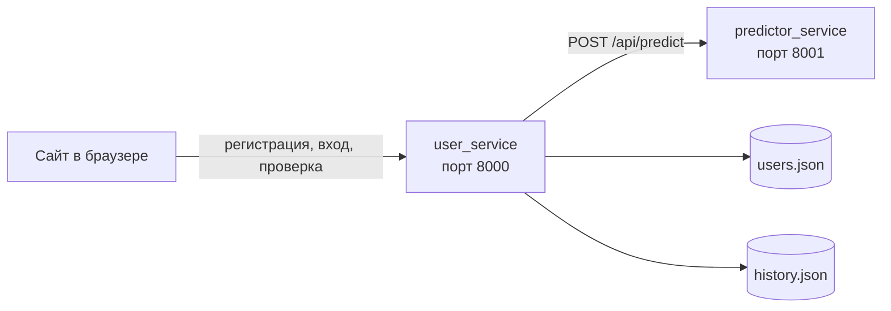
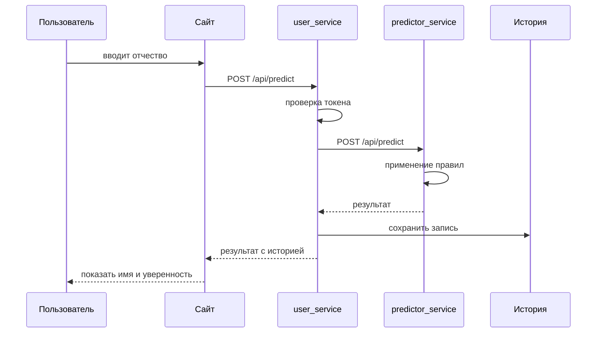
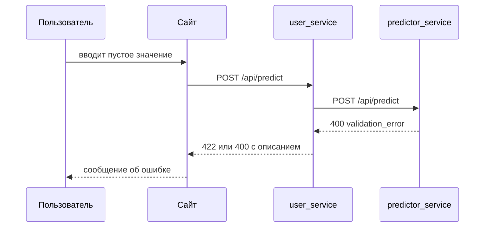

# Диаграммы взаимодействия

## Схема сервисов

```mermaid
flowchart LR
    Browser["Сайт в браузере"]
    UserService["user_service<br/>порт 8000"]
    PredictorService["predictor_service<br/>порт 8001"]
    UserData[("users.json")]
    HistoryData[("history.json")]

    Browser -->|регистрация, вход, проверка| UserService
    UserService -->|POST /api/predict| PredictorService
    UserService --> UserData
    UserService --> HistoryData
```

## Основной сценарий

```mermaid
sequenceDiagram
    participant U as Пользователь
    participant S as Сайт
    participant A as user_service
    participant P as predictor_service
    participant H as История

    U->>S: вводит отчество
    S->>A: POST /api/predict
    A->>A: проверка токена
    A->>P: POST /api/predict
    P->>P: применение правил
    P-->>A: результат
    A->>H: сохранить запись
    A-->>S: результат с историей
    S-->>U: показать имя и уверенность
```

## Обработка ошибки

```mermaid
sequenceDiagram
    participant U as Пользователь
    participant S as Сайт
    participant A as user_service
    participant P as predictor_service

    U->>S: вводит пустое значение
    S->>A: POST /api/predict
    A->>P: POST /api/predict
    P-->>A: 400 validation_error
    A-->>S: 422 или 400 с описанием
    S-->>U: сообщение об ошибке
```
