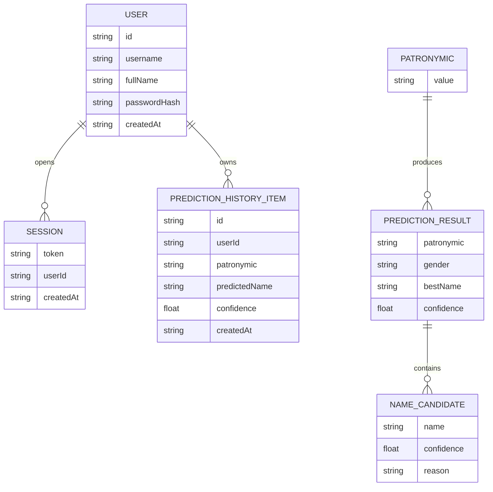
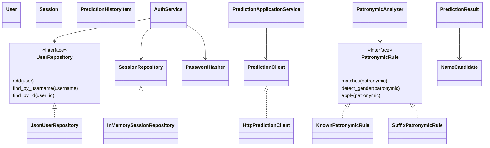

# Предметная область

## Бизнес-контекст

Система помогает пользователю определить имя, от которого образовано русское отчество. Пользователь работает через сайт: регистрируется, входит в аккаунт, вводит отчество и получает результат с пояснением.

## Основные сценарии

1. Регистрация пользователя.
2. Вход пользователя.
3. Проверка отчества.
4. Просмотр истории проверок.
5. Обработка ошибки, если отчество пустое, слишком короткое или не подходит под правила.

## Сущности

- Пользователь: логин, имя, хеш пароля, дата создания.
- Сессия: токен, пользователь, дата создания.
- Отчество: входное значение для проверки.
- Результат определения: найденное имя, пол, уверенность, объяснение.
- Запись истории: пользователь, отчество, найденное имя, уверенность, дата.

## Бизнес-правила

1. Логин уникален.
2. Пароль хранится только в виде хеша.
3. Проверять отчество может только авторизованный пользователь.
4. Отчество должно состоять из букв или дефиса.
5. Точное словарное совпадение важнее общего правила по окончанию.
6. Если правило не найдено, сервис возвращает результат без имени и код `422`.
7. Каждый запрос авторизованного пользователя сохраняется в историю.

## Ограничения

- Прототип хранит данные в JSON-файлах.
- Сессии живут в памяти сервиса и сбрасываются после перезапуска.
- Определение имени не является стопроцентным: для редких отчеств используется вероятностное правило.

## ER-диаграмма

## Диаграмма классов

