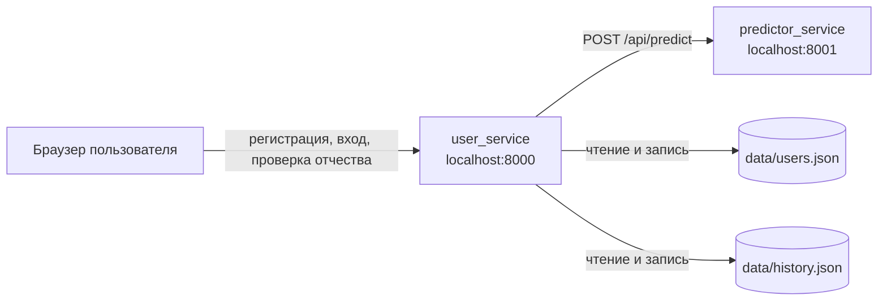
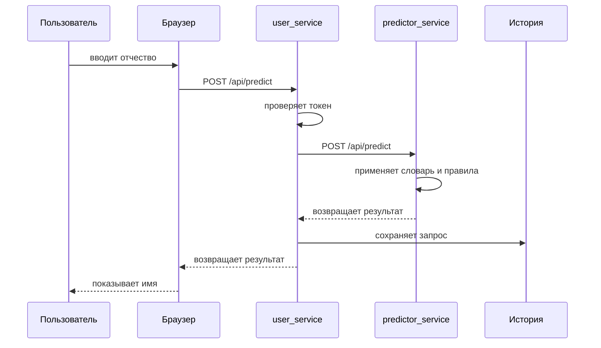
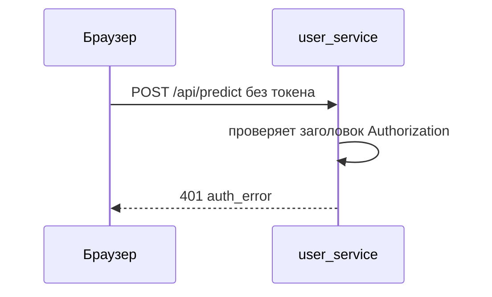
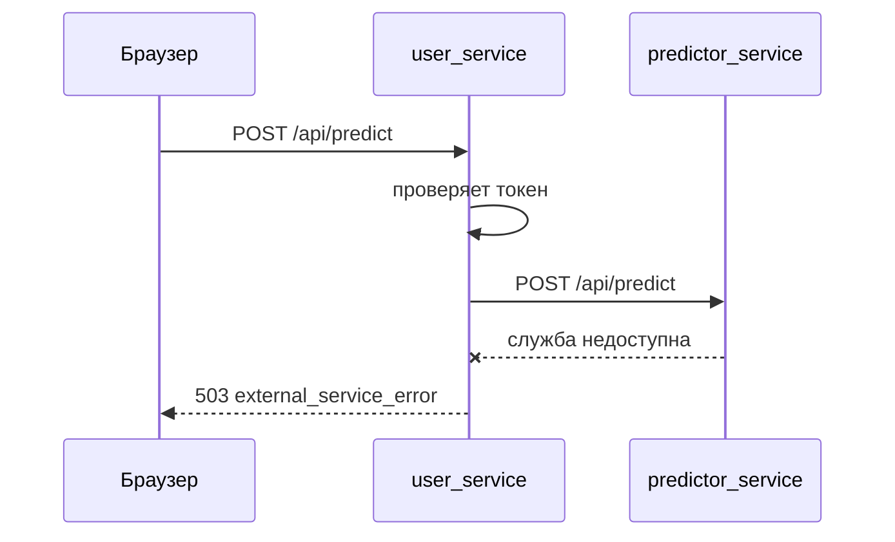

# Этап 2. Проектирование API и договоров

Документ подготовлен под требования финального проекта: https://wiki.backboost.ru/ru/OOP-2026/final-project

## Цель этапа

Цель этапа 2: описать, как части системы общаются между собой и с пользователем. В проекте используется REST API и формат JSON.

Система разделена на две службы:

1. `user_service`: отвечает за сайт, регистрацию, вход, сессии пользователя и историю запросов.
2. `predictor_service`: отвечает за определение имени, от которого образовано отчество.

Такое разделение нужно, чтобы каждая служба имела одну понятную зону ответственности. `user_service` не содержит правил определения имени, а `predictor_service` не знает ничего о пользователях, паролях и истории.

## Общая схема взаимодействия



## Службы и их зоны ответственности

### `user_service`

Базовый адрес: `http://localhost:8000`

Задачи:

- отдает HTML-страницу сайта;
- регистрирует пользователей;
- выполняет вход пользователя;
- создает и проверяет сессии;
- принимает запрос на определение имени;
- обращается к `predictor_service`;
- сохраняет историю запросов пользователя;
- отдает Swagger-страницу.

### `predictor_service`

Базовый адрес: `http://localhost:8001`

Задачи:

- принимает отчество;
- проверяет входные данные;
- ищет точное совпадение в словаре;
- если точного совпадения нет, применяет правила по окончаниям;
- возвращает найденное имя, пол, уверенность и объяснение.

## Формат данных

Все запросы и ответы используют JSON.

Заголовок для запросов с телом:

```text
Content-Type: application/json; charset=utf-8
```

Для закрытых маршрутов используется заголовок:

```text
Authorization: Bearer <token>
```

Токен выдается после регистрации или входа.

## Договор ошибок

Все ошибки возвращаются в одном формате:

```json
{
  "error": "validation_error",
  "message": "Отчество не должно быть пустым."
}
```

Поля:

- `error`: короткий машинный код ошибки;
- `message`: понятное описание для пользователя.

Основные коды ответов:

| Код | Значение |
| --- | --- |
| `200` | Запрос выполнен успешно |
| `201` | Пользователь создан |
| `400` | Ошибка проверки входных данных |
| `401` | Нет авторизации или неверный логин/пароль |
| `404` | Маршрут или файл не найден |
| `409` | Конфликт, например занятый логин |
| `422` | Запрос понятен, но имя по отчеству не найдено |
| `503` | Вторая служба недоступна |

## API `user_service`

### Регистрация пользователя

Маршрут:

```text
POST /api/register
```

Назначение: создать пользователя и сразу открыть сессию.

Запрос:

```json
{
  "fullName": "Алексей Леонов",
  "username": "alexey",
  "password": "secret123"
}
```

DTO запроса:

| Поле | Тип | Обязательное | Описание |
| --- | --- | --- | --- |
| `fullName` | `string` | да | Имя пользователя для отображения |
| `username` | `string` | да | Логин, минимум 3 символа |
| `password` | `string` | да | Пароль, минимум 6 символов |

Ответ `201`:

```json
{
  "token": "session-token",
  "user": {
    "id": "uuid",
    "username": "alexey",
    "fullName": "Алексей Леонов",
    "createdAt": "2026-06-27T10:00:00+00:00"
  }
}
```

DTO ответа:

| Поле | Тип | Описание |
| --- | --- | --- |
| `token` | `string` | Токен сессии |
| `user.id` | `string` | Уникальный номер пользователя |
| `user.username` | `string` | Логин |
| `user.fullName` | `string` | Имя пользователя |
| `user.createdAt` | `string` | Дата создания |

Ошибки:

- `400 validation_error`: логин, пароль или имя не прошли проверку;
- `409 conflict`: пользователь с таким логином уже существует.

### Вход пользователя

Маршрут:

```text
POST /api/login
```

Назначение: проверить логин и пароль, затем открыть сессию.

Запрос:

```json
{
  "username": "alexey",
  "password": "secret123"
}
```

DTO запроса:

| Поле | Тип | Обязательное | Описание |
| --- | --- | --- | --- |
| `username` | `string` | да | Логин пользователя |
| `password` | `string` | да | Пароль |

Ответ `200`:

```json
{
  "token": "session-token",
  "user": {
    "id": "uuid",
    "username": "alexey",
    "fullName": "Алексей Леонов",
    "createdAt": "2026-06-27T10:00:00+00:00"
  }
}
```

Ошибки:

- `401 auth_error`: неверный логин или пароль.

### Текущий пользователь

Маршрут:

```text
GET /api/me
```

Назначение: получить данные текущего пользователя по токену.

Заголовок:

```text
Authorization: Bearer session-token
```

Ответ `200`:

```json
{
  "id": "uuid",
  "username": "alexey",
  "fullName": "Алексей Леонов",
  "createdAt": "2026-06-27T10:00:00+00:00"
}
```

Ошибки:

- `401 auth_error`: токен не передан, сессия не найдена или пользователь не найден.

### Выход пользователя

Маршрут:

```text
POST /api/logout
```

Назначение: закрыть текущую сессию.

Заголовок:

```text
Authorization: Bearer session-token
```

Ответ `200`:

```json
{
  "status": "ok"
}
```

### Определение имени по отчеству

Маршрут:

```text
POST /api/predict
```

Назначение: принять отчество от пользователя, вызвать `predictor_service`, вернуть результат и сохранить историю.

Заголовок:

```text
Authorization: Bearer session-token
```

Запрос:

```json
{
  "patronymic": "Сергеевна"
}
```

DTO запроса:

| Поле | Тип | Обязательное | Описание |
| --- | --- | --- | --- |
| `patronymic` | `string` | да | Отчество для проверки |

Ответ `200`:

```json
{
  "patronymic": "Сергеевна",
  "gender": "female",
  "bestName": "Сергей",
  "confidence": 0.98,
  "candidates": [
    {
      "name": "Сергей",
      "confidence": 0.98,
      "reason": "Найдено точное соответствие в словаре распространенных отчеств."
    }
  ],
  "historyItem": {
    "id": "uuid",
    "userId": "uuid",
    "patronymic": "Сергеевна",
    "predictedName": "Сергей",
    "confidence": 0.98,
    "createdAt": "2026-06-27T10:00:00+00:00"
  }
}
```

DTO ответа:

| Поле | Тип | Описание |
| --- | --- | --- |
| `patronymic` | `string` | Нормализованное отчество |
| `gender` | `string` | Пол носителя отчества: `male`, `female`, `unknown` |
| `bestName` | `string` или `null` | Лучший вариант имени |
| `confidence` | `number` | Уверенность от `0` до `1` |
| `candidates` | `array` | Список вариантов |
| `historyItem` | `object` | Запись, сохраненная в историю |

Ошибки:

- `400 validation_error`: отчество пустое, слишком короткое или содержит неверные символы;
- `401 auth_error`: пользователь не авторизован;
- `422`: имя не найдено;
- `503 external_service_error`: `predictor_service` недоступен.

### История запросов

Маршрут:

```text
GET /api/history
```

Назначение: вернуть историю проверок текущего пользователя.

Заголовок:

```text
Authorization: Bearer session-token
```

Ответ `200`:

```json
{
  "items": [
    {
      "id": "uuid",
      "userId": "uuid",
      "patronymic": "Сергеевна",
      "predictedName": "Сергей",
      "confidence": 0.98,
      "createdAt": "2026-06-27T10:00:00+00:00"
    }
  ]
}
```

Ошибки:

- `401 auth_error`: пользователь не авторизован.

### Swagger

Маршрут:

```text
GET /swagger
```

Назначение: открыть страницу с описанием API.

Ответ:

- `200 text/html`: страница Swagger.

### OpenAPI-файл

Маршрут:

```text
GET /openapi.yaml
```

Назначение: отдать описание API в формате OpenAPI.

Ответ:

- `200 text/yaml`: файл `docs/openapi.yaml`.

## API `predictor_service`

### Проверка состояния службы

Маршрут:

```text
GET /health
```

Назначение: быстро проверить, что служба запущена.

Ответ `200`:

```json
{
  "status": "ok",
  "service": "predictor-service"
}
```

### Определение имени

Маршрут:

```text
POST /api/predict
```

Назначение: определить имя, от которого образовано отчество.

Запрос:

```json
{
  "patronymic": "Иванович"
}
```

DTO запроса:

| Поле | Тип | Обязательное | Описание |
| --- | --- | --- | --- |
| `patronymic` | `string` | да | Отчество |

Ответ `200`:

```json
{
  "patronymic": "Иванович",
  "gender": "male",
  "bestName": "Иван",
  "confidence": 0.98,
  "candidates": [
    {
      "name": "Иван",
      "confidence": 0.98,
      "reason": "Найдено точное соответствие в словаре распространенных отчеств."
    }
  ]
}
```

Ответ `422`, если имя не найдено:

```json
{
  "patronymic": "Неизвестное",
  "gender": "unknown",
  "bestName": null,
  "confidence": 0,
  "candidates": []
}
```

Ошибки:

- `400 validation_error`: отчество не прошло проверку;
- `422`: правило не найдено.

## DTO

### `RegisterRequest`

```json
{
  "fullName": "string",
  "username": "string",
  "password": "string"
}
```

### `LoginRequest`

```json
{
  "username": "string",
  "password": "string"
}
```

### `PredictRequest`

```json
{
  "patronymic": "string"
}
```

### `UserResponse`

```json
{
  "id": "string",
  "username": "string",
  "fullName": "string",
  "createdAt": "string"
}
```

### `NameCandidate`

```json
{
  "name": "string",
  "confidence": 0.98,
  "reason": "string"
}
```

### `PredictionResult`

```json
{
  "patronymic": "string",
  "gender": "male | female | unknown",
  "bestName": "string | null",
  "confidence": 0.98,
  "candidates": []
}
```

### `PredictionHistoryItem`

```json
{
  "id": "string",
  "userId": "string",
  "patronymic": "string",
  "predictedName": "string | null",
  "confidence": 0.98,
  "createdAt": "string"
}
```

### `ErrorResponse`

```json
{
  "error": "string",
  "message": "string"
}
```

## Последовательность основного сценария



## Последовательность ошибки авторизации



## Последовательность ошибки второй службы



## Нефункциональные решения этапа

- Взаимодействие служб синхронное: `user_service` ждет ответ от `predictor_service`.
- Внешний формат данных один: JSON.
- Авторизация нужна только в `user_service`, потому что именно он работает с пользователями.
- `predictor_service` оставлен независимым: его можно заменить или расширить без изменения регистрации и истории.
- OpenAPI-описание хранится в `docs/openapi.yaml`.
- Swagger доступен после запуска по адресу `http://localhost:8000/swagger`.

## Что можно показать на защите

1. Открыть `http://localhost:8000/swagger`.
2. Показать маршруты `POST /api/register`, `POST /api/login`, `POST /api/predict`, `GET /api/history`.
3. Объяснить, что `POST /api/predict` в `user_service` вызывает `POST /api/predict` в `predictor_service`.
4. Показать, что ошибки имеют единый формат: `error` и `message`.
5. Показать файл `docs/openapi.yaml` как машинно-читаемый договор API.
